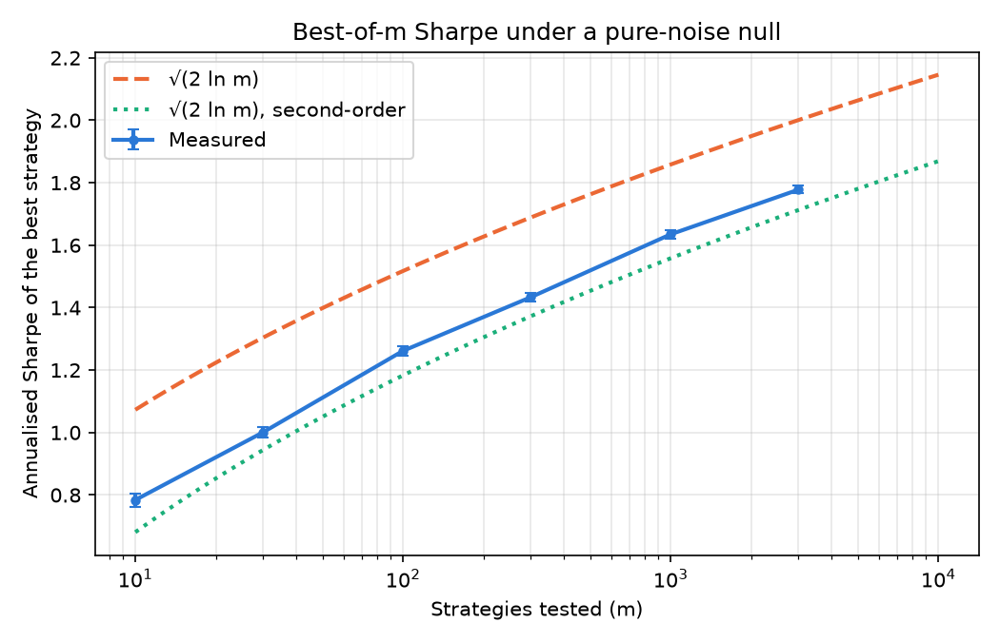

# Multiple Testing in Backtests

How good does the best of 1000 strategies look against pure noise?

## Question

Take 1000 trading strategies, test them on four years of daily returns, and keep the best one.
Given that none of the strategies have any edge by construction, how does the best one look?

An annualised Sharpe of **1.64** was measured. Testing all 1000 strategies individually at the 5%
level, **44 came back significant**, every one of them a false positive, because the returns 
are drawn from a zero-mean normal by construction. Bonferroni and Benjamini–Hochberg keep none of them.

The interesting number is the first one. Once one searches a thousand strategies, a Sharpe near 1.6
is the *null*.

## Method

Returns are i.i.d. normal, zero mean, 1% daily volatility. The volatility cancels out of the
Sharpe ratio entirely, so it sets realism rather than the result. Sharpe is annualised as
√252 · mean / sd with the sample standard deviation (`ddof=1`) and a risk-free rate of zero.

**The sweep** (`max_sharpe_sweep`). For each m in {10, 30, 100, 300, 1000, 3000}: simulate m
zero-edge strategies over 1008 periods, compute every Sharpe, record the maximum. Repeat 200
times per m and average the maxima.

**The survival counts** (`null_survival_counts`). One batch of 1000 zero-edge strategies over the
same horizon. Each annualised Sharpe becomes a one-sided upper-tail p-value, using the fact that
under the null the annualised Sharpe has standard error 1/√years. The same set of p-values then
goes through three rules at α = 0.05: no correction, Bonferroni, and Benjamini–Hochberg.

Every random draw comes from a single generator created in `run_experiment.py` and passed in; no
function in `src/` creates its own. One generator seed reproduces the entire run.

## Results



*Best of m zero-edge strategies, 4 years of daily returns, 200 trials per m, seed 0. Error bars
are the standard error of the mean and are smaller than the markers.*

| m | best Sharpe | SE | √(2 ln m) | second-order |
|---:|---:|---:|---:|---:|
| 10 | 0.784 | 0.021 | 1.073 | 0.681 |
| 30 | 1.001 | 0.017 | 1.304 | 0.944 |
| 100 | 1.262 | 0.016 | 1.517 | 1.183 |
| 300 | 1.433 | 0.014 | 1.689 | 1.373 |
| 1000 | 1.635 | 0.013 | 1.858 | 1.558 |
| 3000 | 1.778 | 0.012 | 2.001 | 1.713 |

The two analytic columns are the standard extreme-value approximations for the expected maximum
of m standard normals, annualised over four years: the textbook √(2 ln m), and the same expression
with its second-order correction, √(2 ln m) − (ln ln m + ln 4π) / (2√(2 ln m)). The measurement
sits between them, closer to the second-order one.

Survival counts for one batch of 1000 zero-edge strategies at α = 0.05:

| Rule | Strategies kept |
|---|---:|
| No correction | 44 |
| Bonferroni | 0 |
| Benjamini–Hochberg | 0 |

44 is what an uncorrected 5% test is supposed to produce on 1000 true nulls — the expected count
is m · α = 50, with a standard deviation of √(m · α · (1−α)) ≈ 6.9. Both corrections remove all of
them.

## Limitations

**The textbook formula overstates the effect.** √(2 ln m) gives 1.86 at m = 1000 where the true
value is 1.62. Thus quoting √(2 ln m) as "the Sharpe you get from luck alone" overstates the
hurdle a real strategy has to clear.

**Returns are i.i.d. normal.** Real return series have fat tails, autocorrelation, and volatility clustering. 
All of these change the distribution of the maximum.

**Strategies are independent.** Backtests from one research process are correlated — same data,
overlapping signals, shared risk factors — so the effective number of independent tests is smaller
than the number of backtests run. At a given m this curve is therefore an upper bound.

**The risk-free rate is zero**, so these are excess-return Sharpes only under that assumption.

**The zeros in the survival table are not a guarantee.** Under the complete null, both corrections
let at least one false discovery through in about 5% of runs — that is the level they promise, not
a failure.

## Reproducing

```bash
git clone https://github.com/QuirrenSR/multiple-testing-in-backtests
cd multiple-testing-in-backtests
python -m pip install -r requirements.txt
python run_experiment.py     # ~40 s, prints both tables and writes the figure
pytest                       # 31 tests
```

`run_experiment.py` is the only file that seeds a generator or writes to disk. `src/sharpe.py`
holds the Sharpe ratio and the noise simulator, `src/corrections.py` the two multiple-testing
corrections and the Sharpe-to-p-value conversion, and `src/experiment.py` the two experiments.
Expected values in the tests are derived on paper or from theory, never pasted from a run.

## References

Benjamini, Y., & Hochberg, Y. (1995). Controlling the false discovery rate: a practical and
powerful approach to multiple testing. *Journal of the Royal Statistical Society: Series B*,
57(1), 289–300.

Harvey, C. R., Liu, Y., & Zhu, H. (2016). … and the cross-section of expected returns.
*The Review of Financial Studies*, 29(1), 5–68.

Bailey, D. H., & López de Prado, M. (2014). The deflated Sharpe ratio: correcting for selection
bias, backtest overfitting, and non-normality. *The Journal of Portfolio Management*, 40(5),
94–107.

White, H. (2000). A reality check for data snooping. *Econometrica*, 68(5), 1097–1126.
